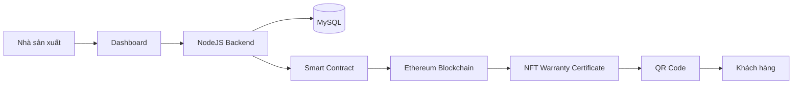

# 🛡️ WARRANTYCHAIN

### Hệ thống Quản lý và Xác thực Chứng nhận Bảo hành Điện tử

**Dai Nam University - Information Technology**

---

## 📖 Giới thiệu

WarrantyChain là hệ thống quản lý chứng nhận bảo hành điện tử sử dụng Blockchain Ethereum.

### Mục tiêu

- Quản lý bảo hành điện tử.
- Phát hành NFT Warranty Certificate.
- Xác thực dữ liệu bằng Blockchain.
- Chống giả mạo chứng nhận.
- Hỗ trợ tra cứu bằng QR Code.

### Lợi ích

✅ Minh bạch dữ liệu

✅ Không thể chỉnh sửa

✅ Xác thực nhanh chóng

✅ Quản lý tập trung

---

## 🏗️ Kiến trúc hệ thống

---

## ⚙️ Công nghệ sử dụng

| Thành phần | Công nghệ |
|------------|-----------|
| Frontend | HTML, CSS, JavaScript |
| Backend | Node.js |
| Blockchain | Ethereum Sepolia |
| Smart Contract | Solidity |
| NFT | ERC721 |
| Database | MySQL |
| Wallet | MetaMask |

---

## 🔄 Quy trình hoạt động

1. Nhập thông tin sản phẩm.
2. Mint NFT bảo hành.
3. Lưu dữ liệu lên Blockchain.
4. Sinh QR Code.
5. Khách hàng xác thực chứng nhận.
6. Hiển thị trạng thái bảo hành.

---

## 📊 Kết quả

✅ Kết nối MetaMask

✅ Triển khai Smart Contract

✅ Mint NFT thành công

✅ Xác thực QR Code

✅ Dashboard quản lý chứng nhận

---

## 🚀 Hướng phát triển

- Ethereum Mainnet
- Mobile Application
- IPFS Storage
- Multi-chain Support
- AI Customer Support

---

## 👨‍💻 Tác giả

**WarrantyChain Blockchain Warranty System**

Dai Nam University - Information Technology

⭐ Star nếu dự án hữu ích ⭐
